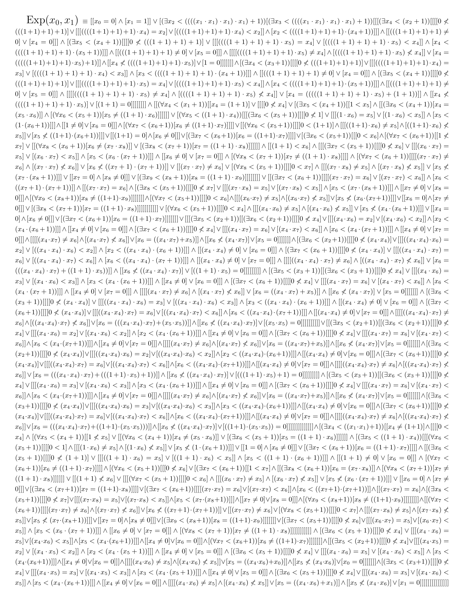

# Theory $\mathsf{I}\Sigma_0$

_These results are included in [Arithmetization](https://github.com/iehality/Arithmetization/tree/master)._

## Exponential

The graph of exponential $\mathrm{Exp}(x, y)$ is definable by $\Sigma_0$-fomrula, 
and its inductive properties are proved in $\mathsf{I}\Sigma_0$.

```lean
instance exponential_definable [M ⊧ₘ* 𝐈𝚺₀] : 𝚺₀-Relation (Exponential : M → M → Prop)
```
- [LO.FirstOrder.Arith.Model.exponential_definable](https://iehality.github.io/Arithmetization/Arithmetization/ISigmaZero/Exponential/Exp.html#LO.FirstOrder.Arith.Model.exponential_definable)




```lean
lemma exponential_zero_one [M ⊧ₘ* 𝐈𝚺₀] :
    Exponential 0 1
```
- [LO.FirstOrder.Arith.Model.Exponential.exponential_zero_one](https://iehality.github.io/Arithmetization/Arithmetization/ISigmaZero/Exponential/Exp.html#LO.FirstOrder.Arith.Model.Exponential.exponential_zero_one)

```lean
lemma exponential_succ_mul_two [M ⊧ₘ* 𝐈𝚺₀] {x y : M} :
    Exponential (x + 1) (2 * y) ↔ Exponential x y
```
- [LO.FirstOrder.Arith.Model.Exponential.exponential_succ_mul_two](https://iehality.github.io/Arithmetization/Arithmetization/ISigmaZero/Exponential/Exp.html#LO.FirstOrder.Arith.Model.Exponential.exponential_succ_mul_two)


Other basic functions, such as $\log x, |x|$ are defined by using exponential.