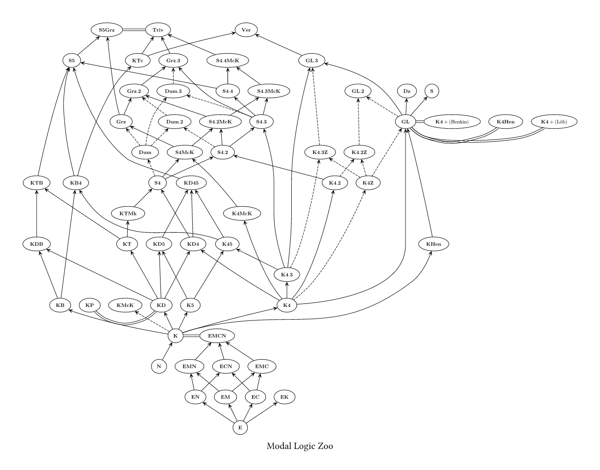
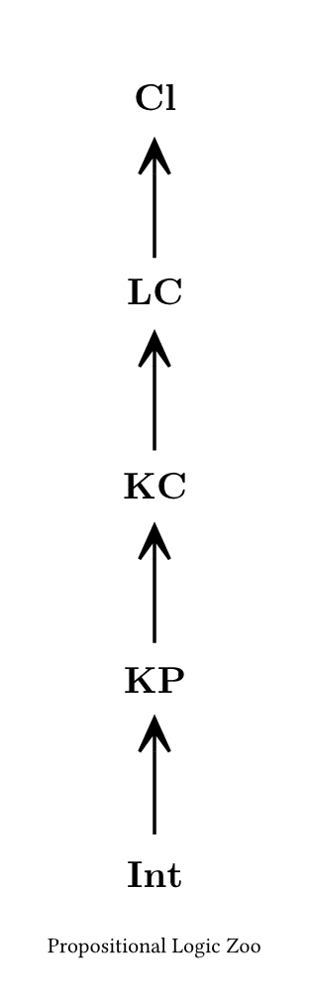
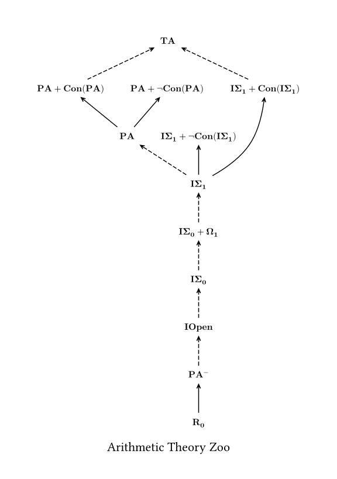

# Intoduction

[Formalized Formal Logic](https://github.com/FormalizedFormalLogic/Foundation) is aim to formalize some various results of mathematical logic in [Lean Theorem Prover](https://lean-lang.org).

## Document

- [Doc](https://formalizedformallogic.github.io/Foundation/doc/Foundation.html)

## Zoo

Visualization for sublogic/subtheory relations.

### Modal Logics

### Propositional Logics

### First-Order Arithmetics

## Import Graph

Generated by [import-graph](https://github.com/leanprover-community/import-graph)

[PDF version](./assets/import_graph.pdf)

[Viasualization](./assets/import_graph.html)
