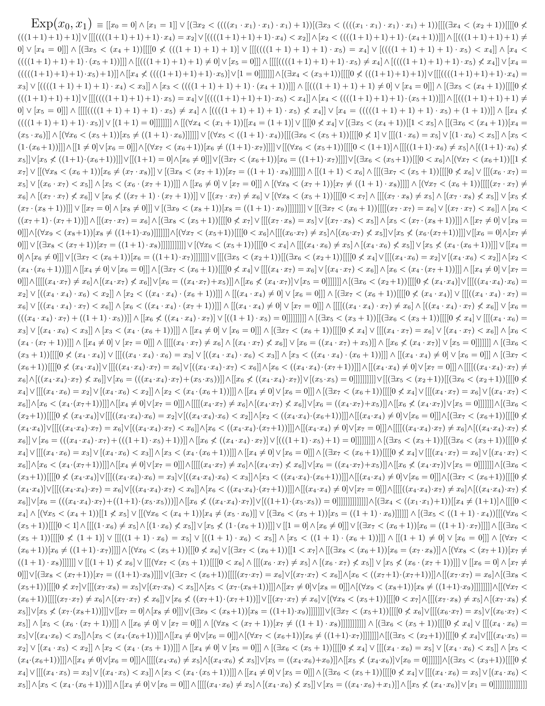

# Theory $\mathsf{I}\Sigma_0$

## Exponential

The graph of exponential $\mathrm{Exp}(x, y)$ is definable by $\Sigma_0$-fomrula,
and its inductive properties are proved in $\mathsf{I}\Sigma_0$.

```lean
instance LO.ISigma0.exponential_definable
    [M ⊧ₘ* 𝗜𝚺₀] : 𝚺₀-Relation (Exponential : M → M → Prop)
```

- [LO.ISigma0.exponential_definable](https://formalizedformallogic.github.io/Foundation/doc/Foundation/FirstOrder/ISigma0/Exponential/Exp.html#LO.ISigma0.exponential_definable)



```lean
lemma LO.ISigma0.Exponential.exponential_zero_one [M ⊧ₘ* 𝗜𝚺₀] :
    Exponential 0 1
```

- [LO.ISigma0.Exponential.exponential_zero_one](https://formalizedformallogic.github.io/Foundation/doc/Foundation/FirstOrder/ISigma0/Exponential/Exp.html#LO.ISigma0.Exponential.exponential_zero_one)

```lean
lemma LO.ISigma0.Exponential.exponential_succ_mul_two
    [M ⊧ₘ* 𝗜𝚺₀] {x y : M} :
    Exponential (x + 1) (2 * y) ↔ Exponential x y
```

- [LO.ISigma0.Exponential.exponential_succ_mul_two](https://formalizedformallogic.github.io/Foundation/doc/Foundation/FirstOrder/ISigma0/Exponential/Exp.html#LO.ISigma0.Exponential.exponential_succ_mul_two)

Other basic functions, such as $\log x, |x|$ are defined by using exponential.
